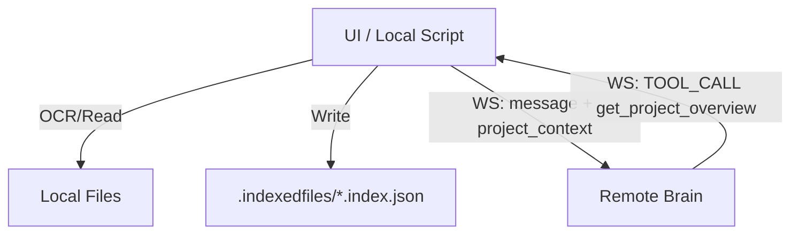

# UI Implementation Guide: Indexing & Project Context

In the remote architecture (Remote Brain + Local UI), indexing moves from being a server-side background task to a **client-side responsibility**. This ensures zero-latency access to local files and avoids overwhelming the WebSocket bridge with massive file transfers.

## 1. The Big Picture

The UI is responsible for maintaining the `.indexedfiles` folder within each project directory. The Backend (Brain) will then consume these indexes proactively or via tools.



---

## 2. Index Structure (`.index.json`)

Each file must have a corresponding `.index.json` file in the `.indexedfiles` directory. This file is a structured JSON object containing:

| Field | Description |
| :--- | :--- |
| `documentType` | e.g., "Contract", "Ordinance", "Application" |
| `summary` | A concise 2-3 paragraph summary of the document. |
| `keywords` | List of key terms or tags. |
| `indexFields` | Dictionary of metadata (e.g., {"Municipality": "Sofia", "Date": "2024"}). |
| `parties` | List of stakeholders: `{ "role": "...", "name": "..." }`. |
| `content` | The full extracted/OCR'd text. |
| `embedding` | (Optional) Vector embedding for semantic search. |
| `last_modified` | Timestamp of the original file when indexed. |

---

## 3. Implementation Strategies

### A. The "Educated Brain" (Recommended)
When the user opens a chat thread, the UI should read all `.index.json` files and send a summary block in the **first WebSocket message**:

```json
{
  "message": "User's first question...",
  "project_context": [
    {
      "path": "/project/file1.pdf",
      "summary": "...",
      "documentType": "...",
      "indexFields": { ... }
    }
  ]
}
```

### B. The "On-Demand" Bridge
If the Brain needs the overview later, it will call the `get_project_overview` tool via WebSocket.

### C. Leveraging Backend for Analysis (Recommended)
The UI can offload its analysis to the Brain without exposing the Google API Key. 

**Workflow:**
1. UI reads file locally (`fs.readFileSync` or OCR).
2. UI calls: `POST /api/analyze` with `{ "content": "..." }`.
3. Brain returns the full `DocumentAnalysis` JSON.
4. UI writes this JSON to `.indexedfiles/filename.index.json` along with the original content and any local metadata.

---

## 4. Local OCR Requirements
The UI must be able to execute the local **PaddleOCR** or **Tesseract** scripts as part of the indexing phase. The resulting text should be stored in the `content` field of the index file.

### Virtual Paths
Always use virtual paths relative to the project root:
- ✅ `/project/documents/contract.pdf`
- ❌ `C:\Users\Name\Documents\Legal\contract.pdf`

---

## 5. Summary & API Changes

By moving indexing to the UI:
1. **Privacy**: Full document contents stay on the user's machine.
2. **Speed**: No need to upload large PDFs to the remote server.
3. **Efficiency**: The Brain starts with "perfect knowledge" of the project structure via `project_context`.

### ⚠️ Obsolete Endpoints
The following REST endpoints on the **Backend** are now **not recommended** in remote mode:
- `GET /api/index/status`: Will likely return incorrect data as the server cannot scan your local disk. **The UI should calculate indexing percentage locally.**
- `POST /api/index/start`: Deprecated. The UI should trigger its own local indexing process instead of asking the server to do it.
